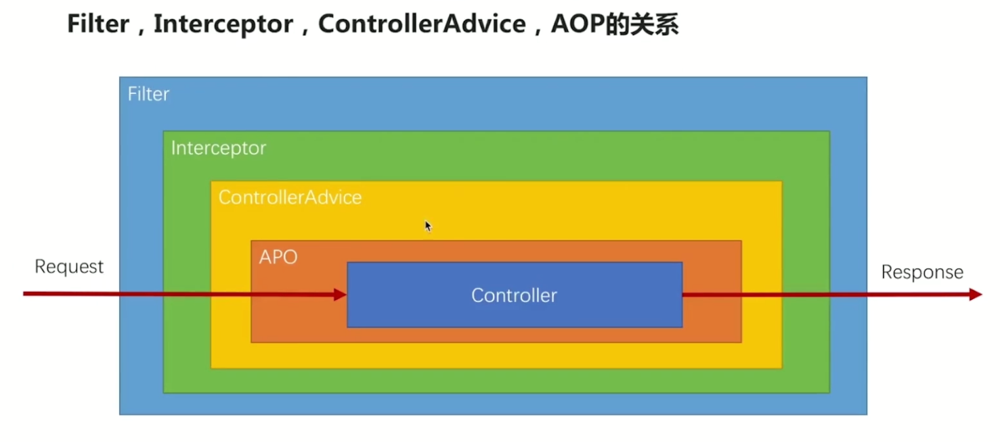
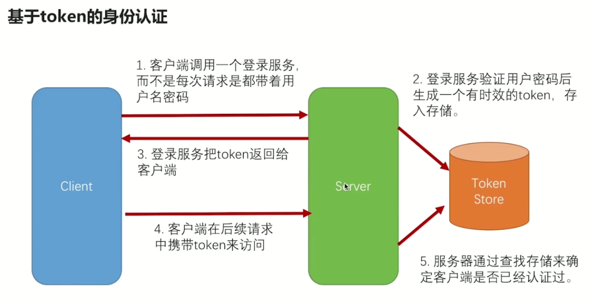
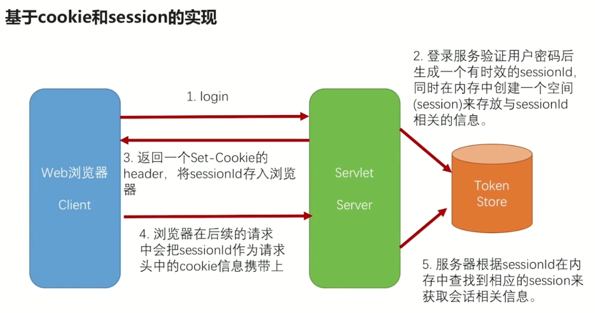

用户管理：

权限设计
at-usercenter

策略选择：
    token获取


api访问控制：
- ACL Access Control lists
简单易用

- RBAC  Role Based Access Control
引入角色概念，简化管理

流控 认证 审计  授权  业务逻辑

# 流控
流量控制
sentinel或者自定义guava

# 认证：

认证信息：
username:jojo
password:123456
组合成:   jojo:123456
Base64加密： lakdfjaldjfla
放入请求头：Authorization: Basic lakdfjaldjfla


密码加密：
MD5属于指纹摘要---不安全
AES---对称加密

盐---为了解决相同密码，加密结果是一样的


https:
keytool -genkeypair -alias jojo -keyalg RSA -keystore jojo.key 

``` yaml
server:
  port: 9010
  ssl:
    key-store: classpath:jojo.key
    key-store-password: asdfasdf
    key-password: asdfasdf
```

# 审计

进出都做
intercepter
aop



# 认证





# 微服务面临的安全考验

多服务追踪
容器化部署导致的证书问题


# SSO
单点登录
session的机制依赖于sessionId，在分布式中采用用户认证中心，在一点登录过，在整个系统中可以跨顶级域名访问。

## sessison共享
## token Redis校验
## jwt加密解密
由一个连接的访问，变成算法调用


